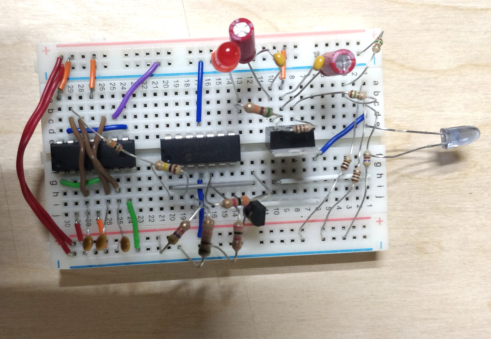
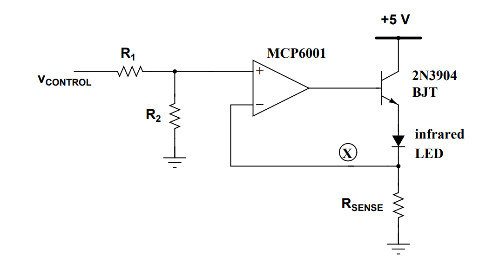
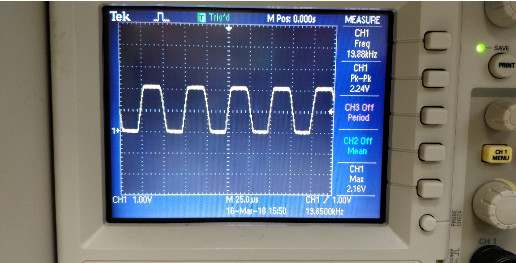

## Infared Signal Transmisson

#### Overview
 Electronics 1 was the third circuit analysis class I had to take covering transistors and diodes.  The motivating project for this class was to build a system capable of transmitting an infrared signal to a reciever maximizing distance.  The transmitter was largerly designed for us while the receiver required design as well as implementation. Project highlights include:

 * Transmitter
  - Runs off a 9V battery
  - CMOS ring oscillator at 20kHz
  - limited to 50 mA output
  - drives infrared LED

* Receiver
  - +/- 12V
  - Three multiple feedback bandpass filters
  - one diode based amplifying circuit
  - detected reliable singal at 4-5 meters

#### Transmitter

* Linear Regulator

  The linear regulator was constructed from a LM317 attached to a 9V battery regulated down to 5V.  This ist to run the CMOS Oscillator and the MCP6001 opamp which operates from 0-5V.  Some added circuitry includes bypass capcitors to and a status LED just as an indicator of when the circuit is on.

  According to the datasheet the equation for calculating Vout is $V_{REF}(1 + R2/R1)$ where the reference voltage is 1.25V.  We selected a 100 ohms resistor for R1 and two 150 ohms resistors for an R2 of 300 ohms to achieve an output of 5V.

  The regulator presented unique challenges when it came to achieving the perform desired.  Because the regulator directly powers a ring oscillator there are moments in time when the is 0mA draw on the voltage regulator.  This along with originally selecting resistor values that were high (10x5) caused issues with the circuit.  The performance reliability of the overall circuit was improved by changing the values of R1 and R2 to lower values.  Further improvement can be achieved by putting a relatively large resistor in parallel to the output to provide a constant small current draw on the output of the regulator.

* Ring Oscillator

  The ring oscillator was based around a CD4007 IC which has 4 CMOS inverters of which we use an odd number 3 to create an oscillator.  This was designed to create a signal at 20kHz which was achieved by placing one 4.7nF and two 10nF capacitors between each stage of the output and ground. Below is the netlist for the oscillator.

      .include CD4007_SpiceModel.cir

      Vs 1 0 DC 5

      * NODE 2 == Output from first CMOS input for 2nd CMOS
      * NODE 3 == Output from the 2nd CMOS input for 3rd CMOS
      * NODE 4 == Output from the 3rd CMOS input for the 1st CMOS

      Xmos 3 1 2 0 3 4 0 2 0 3 1 4 2 1 CMOS4007
      C1 2 0 10n
      C2 3 0 4.7n
      C3 4 0 10n

      .Tran 50u 6m 4.5m
      .END

 This circuit was able to produce the desired signal that was then feed into and amplifying circuit to drive the final LED output.

* Op-Amp

  The opamp used was a MCP6001 which uses 5V and 0V rails and the output was used to drive a IR1503 infrared LED.  Since the current limit of the opamp is only 20mA a 2N3904 NPN was used to increase the current to our desired maximum of 50mA. This amplifier was also designed to take the output of the oscillator which was sinisodial and create a square wave with an aproximately 50% duty cycle. The LED itself is current driven so resistors were placed in series with ground to generate the approiate current across the LED.

  

  In order to get as close to the 50mA mark as possible we used 3 resistors in parralell. Two 100 ohm resistors and 1 470 ohm resistor. This gave us an equivalent resistance of 45.9 ohm which was enough to give us 49.9mA of current.  The photo above displays the second stage used to achieve the correct current.  A first stage was used and a seperate op-amp circuit constructed to create a square wave with a 50% duty cycle which is noticable in the final output below.

  

#### Receiver